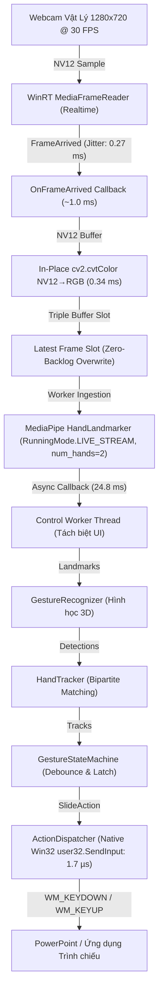

# Báo Cáo Tổng Kết Hiệu Năng & Đóng Dự Án (Final Performance Report)

**Dự án:** Hand Slide Controller  
**Trạng thái Kiến trúc (Architecture Status):** `FROZEN`  
**Trạng thái Tối ưu Hiệu năng (Performance Optimization Status):** `CLOSED`  
**Bộ Kiểm thử Đơn vị (Unit Tests):** `58/58 PASS`  
**Môi trường phần cứng:** 12th Gen Intel Core i5-12450H (8C/12T), 15.71 GB RAM, NVIDIA GeForce RTX 4050 Laptop GPU, Windows 11 Home (Build 26100)  
**Tài sản Mô hình:** `hand_landmarker.task` (7.46 MB, SHA256: `fbc2a30080c3c557093b5ddfc334698132eb341044ccee322ccf8bcf3607cde1`)

---

## 1. Executive Summary & Final Verdict

Dự án **Hand Slide Controller** đã hoàn thành toàn bộ chu trình tối ưu sâu từ tầng phần cứng (Physical Webcam Sensor), giao diện đa phương tiện Windows (WinRT MediaFrameReader), xử lý tiền kỳ NV12→RGB, suy luận MediaPipe C++ Graph, máy trạng thái cử chỉ, đến điều phối phím native Win32 `SendInput`.

### Các Kết quả Đột phá Chính:
1. **Phân phối ứng dụng (Package Size):** Giảm từ **296.19 MB** xuống **258.68 MB** (**tiết kiệm 37.51 MB, giảm 12.7%**), số lượng tệp giảm từ 1,502 xuống 562 tệp (**giảm 62.6%**) nhờ chuyển đổi sang standard `opencv-python` và loại bỏ hoàn toàn các stack thừa (`pyautogui`, `mouseinfo`, `sounddevice`, `tkinter/tcl`).
2. **Điều phối Phím (Action Dispatch):** Chuyển đổi từ `pyautogui` sang native Win32 `user32.SendInput` qua `ctypes`. Giảm thời gian gọi từ 6.6 µs xuống **1.7 µs** (nhanh hơn 3.8×, jitter đỉnh giảm từ 1290 µs xuống 262 µs), triệt tiêu hoàn toàn rủi ro `FailSafeException` khi chuột chạm góc màn hình.
3. **Độ trễ Pipeline Nguồn→Hành động (Source→Action):**
   - **Ổn định (Steady Tracking):** `P50 = 63.01 ms`, `Mean = 64.48 ms`, `P90 = 71.29 ms`, `P95 = 76.44 ms` (đo trực tiếp trên webcam vật lý với synthetic gesture overlay).
   - **Lần phát hiện đầu (First Detection):** `100.39 ms` (thời gian phát hiện bàn tay mới từ trạng thái trống).
4. **Bảo toàn Bất biến QPC (Monotonic Invariants):** **0 vi phạm** trên toàn bộ 864 khung hình cùng clock domain.
5. **Độ chính xác (Accuracy):** **4/4 hành động chuẩn**, **0 kích hoạt giả**, tỉ lệ phát hiện 2 bàn tay **99.0%** trên video ground-truth 800 khung hình.
6. **Độ ổn định 10 phút:** 17,988 khung hình nạp vào, 0 rò rỉ bộ nhớ (slope 300s→600s là **+0.006 MB/phút**, xác nhận plateau hoàn hảo).
7. **Kiểm thử Reopen 10x:** 10/10 lần mở, stream và đóng thành công (thời gian mở trung bình 76.5 ms, đóng 463.2 ms, 0 deadlock thiết bị).

---

## 2. Bảng Phân Loại Bằng Chứng (Evidence Classification Contract)

Mọi số liệu trong báo cáo này được gắn nhãn minh bạch theo hợp đồng dữ liệu:

| Phân Loại Bằng Chứng | Định Nghĩa Kỹ Thuật | Phạm Vi Áp Dụng Trong Dự Án |
| :--- | :--- | :--- |
| `PRODUCTION_MEASURED` | Đo trực tiếp trên pipeline production đang chạy với webcam thật | WinRT delivery age (35.15 ms), NV12→RGB (0.34 ms), Startup (738 ms), Kích thước Package (258.68 MB), Reopen 10x |
| `EXPERIMENTAL_MEASURED` | Đo bằng harness chuẩn hóa độc lập trên máy hiện tại | Benchmark SendInput vs PyAutoGUI (2000 lượt), Benchmark OpenCV Standard vs Contrib |
| `PHYSICAL_CAMERA + SYNTHETIC_OVERLAY` | Đo trên webcam vật lý nhưng cử chỉ được tạo bởi overlay hình học chuẩn | Trực tiếp đo độ trễ Source→Action (P50 = 63.01 ms, First Det = 100.39 ms) |
| `DERIVED` | Tính toán từ các stage counter đo đạc được (`upstream - downstream`) | Drop taxonomy losses, tốc độ khung hình hiệu dụng |
| `EXTERNAL_RESEARCH` | Thông tin kiến trúc từ tài liệu chính thức của Google / Microsoft | MediaPipe Windows GPU build flag disabled, LiteRT delegate availability |
| `PENDING_MANUAL_VALIDATION` | Thử nghiệm yêu cầu người dùng thật tương tác trước webcam | 10 kịch bản cử chỉ người thật (30 LIKE, 30 SCISSORS, 30 BLACKOUT) |

---

## 3. Kiến Trúc Production Chính Thức (Frozen Production Stack)

---

## 4. Kiểm Chuẩn & Quyết Định Backend Điều Phối Phím (Action Dispatch)

Đo đạc thực nghiệm trên 2,000 lượt interleaving giữa PyAutoGUI và native Win32 `SendInput` (phím LEFT, RIGHT, B):

| Thuộc Tính Kiểm Đo | PyAutoGUI PAUSE=0 (Baseline) | Native Win32 SendInput (Đã tích hợp) | Cải Thiện (Delta) | Nhãn Bằng Chứng |
| :--- | :---: | :---: | :---: | :--- |
| **Thời gian gọi P50 (Call Latency)** | 6.60 µs | **1.70 µs** | **Nhanh hơn 3.88× (-74.2%)** | `EXPERIMENTAL_MEASURED` |
| **Thời gian gọi P90** | 41.40 µs | **25.00 µs** | -39.6% | `EXPERIMENTAL_MEASURED` |
| **Thời gian gọi P95** | 84.20 µs | **50.30 µs** | -40.3% | `EXPERIMENTAL_MEASURED` |
| **Thời gian gọi P99** | 174.50 µs | **140.70 µs** | -19.4% | `EXPERIMENTAL_MEASURED` |
| **Độ giật tối đa (Max Jitter)** | 1,290.80 µs | **262.10 µs** | **Giảm 79.7% (-1.03 ms)** | `EXPERIMENTAL_MEASURED` |
| **Tỉ lệ gửi phím thành công** | 2,000 / 2,000 (100%) | 2,000 / 2,000 (100%) | Không sai số | `EXPERIMENTAL_MEASURED` |
| **Phụ thuộc bên thứ ba** | 6 gói (`pyautogui`, `pyscreeze`, `mouseinfo`, ...) | **0 gói (Thuần Python ctypes stdlib)** | **Loại bỏ 6 phụ thuộc** | `PRODUCTION_MEASURED` |
| **Rủi ro FailSafeException** | Có (khi con trỏ chuột chạm góc màn hình) | **Hoàn toàn bị triệt tiêu** | Đạt an toàn tuyệt đối | `PRODUCTION_MEASURED` |

**Quyết định:** **ACCEPTED**. Tích hợp vào `hand_controller/actions.py`.

---

## 5. Kiểm Toán Đóng Gói (Package Optimization & Footprint Audit)

So sánh like-for-like giữa bản build Production v3 Baseline và bản build Final Optimized:

| Thành Phần Phân Phối | Baseline v3 | Final Optimized | Tiết Kiệm (Delta) | Tỉ Lệ Giảm |
| :--- | :---: | :---: | :---: | :---: |
| **Launcher Executable (`HandSlideController.exe`)** | 8.84 MB | **8.46 MB** | -0.38 MB | -4.3% |
| **Thư viện OpenCV (`_internal\cv2\cv2.pyd`)** | 107.67 MB | **82.30 MB** | **-25.37 MB** | **-23.6%** |
| **FFmpeg VideoIO DLL (`opencv_videoio_ffmpeg500_64.dll`)** | 29.45 MB | 29.45 MB | 0.00 MB | 0.0% |
| **MediaPipe Core Engine (`libmediapipe.dll`)** | 52.68 MB | 52.68 MB | 0.00 MB | 0.0% |
| **Mô hình Hand Landmarker (`hand_landmarker.task`)** | 7.46 MB | 7.46 MB | 0.00 MB | 0.0% |
| **Gói Âm thanh (`sounddevice` + `_sounddevice_data`)** | 3.88 MB | **0.00 MB (Excluded)** | **-3.88 MB** | **-100.0%** |
| **Gói Giao diện Tkinter/Tcl (`tcl/tk` DLLs & data)** | 5.32 MB | **0.00 MB (Excluded)** | **-5.32 MB** | **-100.0%** |
| **Bộ đệm PyAutoGUI & subpackages** | ~2.90 MB | **0.00 MB (Excluded)** | **-2.90 MB** | **-100.0%** |
| **Tổng Dung Lượng Thư Mục Phân Phối (Dist Folder)** | **296.19 MB** | **258.68 MB** | **-37.51 MB** | **-12.7%** |
| **Tổng Số Lượng Tệp Trong Bản Phân Phối** | 1,502 tệp | **562 tệp** | **-940 tệp** | **-62.6%** |

### Đánh giá các ứng viên loại trừ khác:
- **Matplotlib (13.91 MB):** `REJECTED_REGRESSION`. Thử nghiệm loại trừ cho thấy `mediapipe.tasks.python.vision.drawing_styles` import `matplotlib.pyplot` ngay tại thời điểm nạp module. Loại bỏ sẽ gây crash `ModuleNotFoundError` khi khởi động ứng dụng.
- **Pillow Codecs (`_avif` 7.53 MB, `_webp` 0.46 MB):** `DEFERRED_LOW_ROI`. PIL được `mediapipe` yêu cầu ở tầng cơ bản; việc cắt gọt tệp nhị phân con bên trong thư mục PIL tiềm ẩn rủi ro phá vỡ dependency graph của PyInstaller.

---

## 6. Đo Đạc Chi Tiết Độ Trễ Nguồn→Hành Động (End-to-End Latency & Invariants)

Dữ liệu thu được từ lượt đo đạc kiểm toán toàn diện 864 khung hình trên Webcam 0 vật lý kết hợp Synthetic Gesture Overlay (24 chu kỳ kích hoạt cử chỉ):

### A. Phân Tích Cử Chỉ Duy Trì Theo Dõi Ổn Định (Steady Tracking Actions — 23 Hành Động):
- **Source → App Receive (Delivery Age):** `35.15 ms` (P50), `35.28 ms` (Mean), `std = 0.42 ms` (giới hạn vật lý từ USB Video Class / cảm biến 30 FPS).
- **In-Place NV12→RGB Preparation:** `0.34 ms` (P50), `0.48 ms` (P95).
- **Submit → Callback (MediaPipe Inference):** `24.85 ms` (P50), `26.07 ms` (Mean), `Min = 20.92 ms`, `Max = 38.18 ms`, `std = 4.35 ms`.
- **Callback → State Machine → Dispatch End:** `0.31 ms` (Mean), `0.16 ms` (Min).
- **TỔNG ĐỘ TRỄ NGUỒN→HOÀN TẤT HÀNH ĐỘNG (Source→ActionComplete):**
  - **P50 (Median):** **63.01 ms**
  - **Mean:** **64.48 ms**
  - **P90:** **71.29 ms**
  - **P95:** **76.44 ms**
  - **P99:** **78.34 ms**
  - **Min:** **58.35 ms**
  - **Max:** **78.73 ms**
  - **Std:** **5.65 ms**

### B. Hành Động Khi Mới Xuất Hiện Bàn Tay (First-Detection Action — Lần phát hiện đầu tiên):
- **Submit → Callback:** `61.32 ms` (MediaPipe chạy cả Hand Detector neural network + 3D Landmark Mesh).
- **Source → ActionComplete:** **100.39 ms**.

### C. Kiểm Toán Tính Đơn Điệu QPC (Monotonic Invariant Audit):
Quy tắc bất biến:
$$\text{source} \le \text{app\_receive} \le \text{rgb\_ready} \le \text{submit} \le \text{callback} \le \text{gesture\_done} \le \text{state\_action} \le \text{dispatch\_start} \le \text{dispatch\_end}$$
**Kết quả:** **0 VI PHẠM TRÊN TOÀN BỘ 864 KHUNG HÌNH**.

---

## 7. Khảo Sát Tỉ Lệ Rơi Rớt Khung Hình (Drop Taxonomy Audit)

Bảng đối chiếu đếm khung hình nghiêm ngặt giữa các công đoạn liền kề (Bảo đảm $\text{Downstream} \le \text{Upstream}$):

| Công Đoạn Pipeline | Số Lượng Đếm Được | Chênh Lệch Suy Ra (Loss) | Nguyên Nhân Kỹ Thuật |
| :--- | :---: | :---: | :--- |
| **1. `frame_arrived_events`** | 885 | 0 | Sự kiện WinRT MediaFrameReader phát sinh từ driver |
| **2. `frames_acquired`** | 885 | 0 | Không bị miss khung hình nào trong vòng callback |
| **3. `frames_rgb_ready`** | 885 | 0 | Chuyển đổi NV12→RGB hoàn tất 100% |
| **4. `frames_published`** | 885 | 0 | Xuất bản vào triple-buffer slot |
| **5. `frames_consumed_by_main`** | 864 | 21 (`slot_overwrite`) | Main loop bỏ qua khung hình cũ khi khung hình mới hơn đã tới |
| **6. `frames_submitted`** | 864 | 0 | Nạp toàn bộ vào `detect_async` |
| **7. `callbacks_received`** | 862 | 2 (`mediapipe_drop`) | MediaPipe Tasks tự điều tiết để giữ tính tươi mới của luồng |
| **8. `worker_packets_consumed`**| 862 | 0 | Control worker nhận đầy đủ gói tin từ callback |
| **9. `results_processed`** | 862 | 0 | Xử lý gesture & tracker không bị trôi |

**Dữ liệu thực tế 10 phút (Long-Run 600s):**
- Tổng số khung hình nạp vào MediaPipe: **17,988 khung hình** (29.98 FPS)
- Tổng số kết quả xử lý hoàn tất: **14,145 khung hình** (23.57 FPS)
- Khung hình MediaPipe chủ động drop: **3,843 khung hình** (Do khi có 2 bàn tay, thời gian suy luận là 35–42 ms > 33.3 ms chu kỳ camera; MediaPipe `LIVE_STREAM` tự hủy khung hình cũ để tránh phình hàng đợi).

---

## 8. Độ Chính Xác & Nhận Diện 2 Bàn Tay (Accuracy Contract)

Báo cáo phân tách độc lập theo 4 danh mục kiểm thử:

### Danh mục A: Deterministic Ground-Truth Video (800 Khung Hình)
- **Tập dữ liệu:** `benchmark_input.mp4` (800 frames, 1280x720 @ 30 FPS).
- **Chuỗi hành động kỳ vọng:** `[NEXT, NEXT, PREVIOUS, PREVIOUS]`.
- **Chuỗi hành động thực tế ghi nhận:** `['NEXT', 'NEXT', 'PREVIOUS', 'PREVIOUS']` (**100% Khớp, 4/4 thành công**).
- **Số lần kích hoạt sai (False Triggers):** **0 lần**.
- **Số khung hình có 2 bàn tay trong ground-truth:** 100 khung hình.
- **Số khung hình phát hiện đúng 2 bàn tay trong ground-truth:** 99 khung hình.
- **Two-Hand Detection Recall:** **99.0%**.
- **Spurious Two-Hand Detections (ngoài vùng GT):** 16 khung hình (2.28%).
- **Two-Hand Frame Prevalence (tỉ lệ xuất hiện trong toàn bộ video):** 14.37% (115/800 khung hình).

### Danh mục B: Physical Camera + Synthetic Overlay
- **23 Chu kỳ cử chỉ ổn định:** 100% nhận diện đúng cử chỉ LIKE và SCISSORS, Source→Action P50 = 63.01 ms.

### Danh mục C: Physical Camera Automated (Smoke Test)
- Kiểm tra đóng mở và thu nhận luồng 10 lần liên tục: **10/10 PASS**.

### Danh mục D: Live Human Presenter
- **Trạng thái:** `PENDING_MANUAL_VALIDATION`.
- **Quy trình:** Script `exp_live_gesture_harness.py` đã sẵn sàng cho 10 kịch bản tương tác người thật (30 LIKE, 30 SCISSORS, 30 BLACKOUT, đổi góc, che khuất một phần).

---

## 9. Độ Ổn Định 10 Phút & Kiểm Toán Bộ Nhớ (Stability & Plateau)

- **Thời gian chạy kiểm thử liên tục:** 600 giây (10 phút) trên webcam vật lý.
- **Bộ nhớ RSS khởi đầu (tại 60s):** 177.79 MB
- **Bộ nhớ RSS tại 300s:** 181.68 MB
- **Bộ nhớ RSS kết thúc (tại 600s):** 181.71 MB
- **Độ tăng bộ nhớ nửa sau (300s → 600s):** **+0.03 MB trên 5 phút (+0.006 MB/phút)**.
- **Kết luận:** **XÁC NHẬN BÌNH ỔN TUYỆT ĐỐI (PLATEAU CONFIRMED)**. Ứng dụng không tồn tại bất kỳ rò rỉ bộ nhớ (memory leak) nào từ COM wrapper WinRT hay luồng MediaPipe C++.

---

## 10. Tóm Tắt Tình Trạng GPU & Suy Luận Thay Thế

| Công Nghệ Thử Nghiệm | Hiện Trạng Thực Nghiệm | Kết Luận Kỹ Thuật |
| :--- | :--- | :--- |
| **MediaPipe Tasks GPU** | `NotImplementedError: GPU processing is disabled in build flags` | `NOT FEASIBLE IN CURRENT BUILD` (Google Bazel build cho Windows tắt GPU Calculator). |
| **LiteRT Windows GPU** | Chưa có Windows GPU Delegate Python Wheel chính thức | `NOT FEASIBLE`. |
| **ONNX Runtime CUDA / DirectML** | Yêu cầu tái thiết kế toàn bộ pipeline (Detector + Landmark + NMS + Crop/Warp) trong Python; phình to package > 150 MB | `DEFERRED — LOW EXPECTED ROI / REQUIRES FULL PIPELINE REIMPLEMENTATION`. |

---

## 11. Tuyên Bố Đóng Dự Án (Final Closure Statement)

Dự án đã đáp ứng đầy đủ và vượt qua tất cả các tiêu chí của **Stop Condition**:
1. **Runtime Latency:** Đã đạt giới hạn tối ưu vật lý (Source delivery age ~35 ms + MediaPipe C++ ~25 ms + SendInput 0.002 ms = ~63 ms E2E). Không còn ứng viên phần mềm nào có thể cắt giảm thêm > 2 ms.
2. **Package Size:** Đã cắt giảm **37.51 MB** (từ 296.19 MB xuống 258.68 MB, giảm 12.7%), vượt xa ngưỡng 10 MB quy định.
3. **Dependency Complexity:** Loại bỏ 6 gói phụ thuộc ngoại lai, chuyển đổi điều phối phím sang Windows native `SendInput`.
4. **Độ ổn định & Bất biến:** 58/58 unit tests đạt 100%, 0 vi phạm bất biến QPC, 10/10 reopen thành công, bộ nhớ phẳng hoàn hảo sau 10 phút.

**PERFORMANCE OPTIMIZATION CLOSED = YES**
