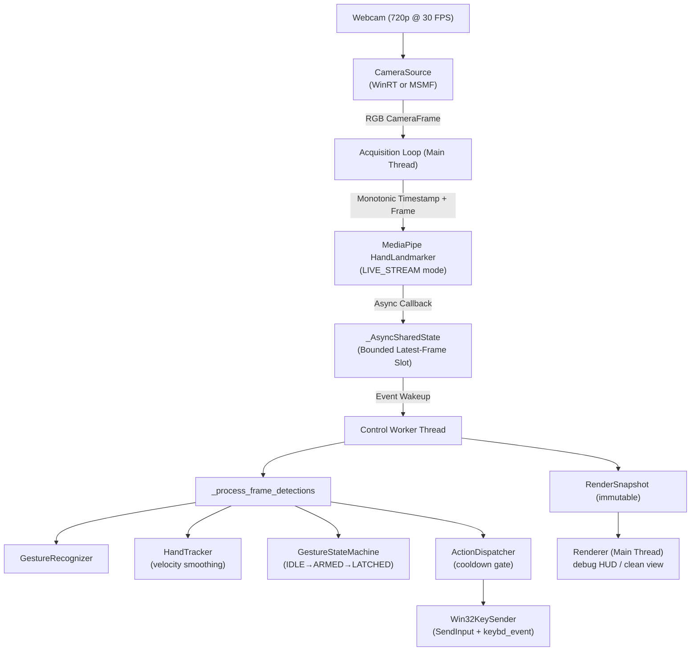

# HAND SLIDE CONTROLLER

A real-time hand gesture controller that lets you navigate presentation slides (Previous, Next, Blackout) hands-free using your webcam and AI-powered hand landmark detection.

No physical contact required — simply show a **Scissors gesture** to go back, a **Thumbs Up (Like)** to advance, or an **Open Palm** to blackout the screen.

---

## 🎯 FEATURES

- Detect and track up to 2 hands simultaneously, each controlled independently.
- Recognize three gestures in real time:
  - ✂️ **Scissors** (index + middle finger extended and spread) → ← Previous Slide
  - 👍 **Vertical Like** (thumb pointing upward, fingers folded) → → Next Slide
  - 🖐 **Open Palm** (all 5 fingers extended outward) → `B` key (Blackout / Screen Off)
- Gesture stabilization system prevents accidental triggers.
- Velocity-aware state machine blocks actions while the hand is moving fast.
- **Debug overlay** showing per-hand gesture state, motion speed, and landmark data.
- **Clean mode** (press `D`) for a minimal heads-up display.
- Support for both WinRT native camera (primary) and OpenCV MSMF (automatic fallback).
- 1280×720 @ 30 FPS default; configurable via `AppConfig`.
- Windows process priority elevation for smoother capture on busy machines.
- Minimize to taskbar with `H` key.
- Standalone distributable `.exe` via PyInstaller (no Python installation required on target machine).

> **Note:** The controller only sends keyboard inputs (`Left Arrow`, `Right Arrow`, `B`). It works with any presentation software (PowerPoint, Google Slides, Keynote via Parallels, PDF viewers, etc.).

---

## 🛠 TECHNOLOGIES

### Core

- Python 3.12
- [MediaPipe](https://ai.google.dev/edge/mediapipe/solutions/vision/hand_landmarker) — Hand landmark detection model (`hand_landmarker.task`)
- [OpenCV](https://opencv.org/) (`opencv-python 5.x`) — Camera capture, frame processing, and debug rendering
- [NumPy](https://numpy.org/) — NV12 plane unpacking and image buffer management
- WinRT (`winrt-*`) — Native Windows Runtime MediaCapture with `MediaFrameReader` for low-latency capture
- `ctypes` / Win32 API — Native `SendInput` (40-byte 64-bit struct) for reliable keystroke injection

### Packaging

- [PyInstaller](https://pyinstaller.org/) — Single-directory distributable with bundled model and all dependencies

### Testing

- [pytest](https://pytest.org/) — 67 automated unit tests across all core modules

---

## 📁 PROJECT STRUCTURE

```text
hand-slide-controller/
├── hand_controller/              # Core application logic
│   ├── config.py                 # Immutable dataclass configs (Camera, Tracking, Gesture, Motion, App)
│   ├── models.py                 # Domain types: Gesture, SlideAction, GesturePhase, HandTrack, RenderSnapshot
│   ├── geometry.py               # Pure geometric functions (angle_2d, distance_2d, xy_distance)
│   ├── hand_features.py          # Palm scale / center extraction and finger fold/extension checks
│   ├── gestures.py               # GestureRecognizer: SCISSORS, LIKE, and OPEN_PALM heuristics
│   ├── tracker.py                # Multi-hand spatial-temporal assignment and wrist velocity smoothing
│   ├── state_machine.py          # FSM: IDLE → STABILIZING → ARMED → LATCHED with velocity gate
│   ├── actions.py                # ActionDispatcher, Win32KeySender, Win32AudioPlayer (with protocols)
│   ├── camera.py                 # CameraSource ABC, WinRTCameraSource, OpenCVMSMFCameraSource, factory
│   ├── renderer.py               # Renderer, RenderTheme, debug HUD and landmark overlays
│   └── app.py                    # App coordinator: async capture loop, Control Worker thread, preview
├── tests/                        # 67 unit tests
│   ├── test_actions.py           # ActionDispatcher with MockKeySender and MockAudioPlayer
│   ├── test_app_refactor.py      # App DI, SW_MINIMIZE, _process_frame_detections
│   ├── test_async_pipeline.py    # Callback, shared state, eviction and drop counters
│   ├── test_camera.py            # NV12 unpacker, factory fallback, diagnostics
│   ├── test_config.py            # Config defaults and field values
│   ├── test_gestures.py          # GestureRecognizer landmark classification
│   ├── test_models.py            # Domain models, enums, and mapping tables
│   ├── test_state_machine.py     # FSM phases, velocity gate, open palm blackout
│   └── test_tracker.py           # Track assignment, reacquire, expire, velocity update
├── tools/
│   ├── inventory.py              # Repository file inventory utility
│   └── cleanup.py                # Temporary file cleanup utility
├── main.py                       # Entry point
├── hand_landmarker.task          # Frozen MediaPipe hand landmark model (~34 MB)
├── HandSlideController.spec      # PyInstaller build specification
└── README.md                     # This file
```

---

## 🚀 GETTING STARTED

### REQUIREMENTS

- Windows 10 or Windows 11 (64-bit)
- A USB or built-in webcam capable of 720p @ 30 FPS
- Python 3.12 (for running from source)

### 1. CLONE THE PROJECT

```bash
git clone https://github.com/52ducbanh/hand-slide-controller.git
cd hand-slide-controller
```

### 2. CREATE A VIRTUAL ENVIRONMENT

```powershell
python -m venv .venv
.\.venv\Scripts\Activate.ps1
```

### 3. INSTALL DEPENDENCIES

```powershell
pip install -r requirements.txt
```

Key packages installed:

| Package | Purpose |
| --- | --- |
| `mediapipe` | Hand landmark detection |
| `opencv-python` | Camera capture and rendering |
| `numpy` | Buffer handling |
| `winrt-*` | Windows native camera API |
| `psutil` | Process priority elevation |
| `pyinstaller` | Standalone packaging |
| `pytest` | Automated testing |

### 4. RUN FROM SOURCE

```powershell
python main.py
```

A preview window will open. Allow camera access if prompted.

---

## ⌨️ KEYBOARD CONTROLS

| Key | Action |
| --- | --- |
| `D` | Toggle debug overlay (landmark data, gesture states, speed) |
| `H` | Minimize controller window to taskbar |
| `Q` | Quit the controller |

---

## ✋ GESTURE REFERENCE

| Gesture | Hand Shape | Slide Action | Key Sent |
| --- | --- | --- | --- |
| **Scissors** | Index + Middle extended and spread apart | ← Previous | `Left Arrow` |
| **Vertical Like** | Thumb pointing straight up, all fingers folded | → Next | `Right Arrow` |
| **Open Palm** | All 5 fingers fully extended outward | ⬛ Blackout | `B` |

### How the gesture state machine works

```text
IDLE → (gesture held steady) → STABILIZING → (stable for 80 ms) → ARMED
ARMED → (hand speed ≤ threshold) → action dispatched → LATCHED
LATCHED → (return to neutral) → IDLE (with 150 ms rearm debounce)
```

Accidental triggers are prevented by:
- Requiring the gesture to be stable for at least **80 ms** before arming.
- Blocking dispatch if the wrist velocity exceeds the configured threshold.
- Applying a global action cooldown of **220 ms** between consecutive actions.

---

## ⚙️ CONFIGURATION

All settings live in [`hand_controller/config.py`](hand_controller/config.py) as frozen dataclasses. You can override any value by passing a custom `AppConfig` to `App()`:

```python
from hand_controller.config import AppConfig, CameraConfig, TrackingConfig
from hand_controller.app import App

cfg = AppConfig(
    camera=CameraConfig(width=1920, height=1080, fps=30, backend="WINRT"),
    num_hands=2,
    debug=False,
)
App(cfg).run()
```

### Key Configuration Fields

| Field | Default | Description |
| --- | --- | --- |
| `camera.width` | `1280` | Capture resolution width |
| `camera.height` | `720` | Capture resolution height |
| `camera.fps` | `30` | Target frame rate |
| `camera.backend` | `"AUTO"` | `"AUTO"`, `"WINRT"`, or `"MSMF"` |
| `num_hands` | `2` | Maximum number of tracked hands |
| `global_action_cooldown` | `0.22` | Minimum seconds between dispatched actions |
| `tracking.gesture_stable_time` | `0.08` | Seconds a gesture must be held before arming |
| `tracking.rearm_stable_time` | `0.15` | Seconds in neutral before re-arming after a latch |
| `tracking.max_trigger_velocity` | `1.2` | Wrist velocity above which actions are blocked |
| `debug` | `True` | Show debug HUD overlay |
| `audio_feedback` | `False` | Play a sound on each dispatched action |

---

## 📦 BUILD STANDALONE EXECUTABLE

Build a distributable folder for Windows that requires no Python installation:

```powershell
pyinstaller HandSlideController.spec --noconfirm
```

Output is placed in `dist\HandSlideController\`. Distribution stats:

| Item | Value |
| --- | --- |
| Launcher EXE size | ~8.5 MB |
| Total distribution size | ~258.7 MB |
| File count | 674 files |

To distribute, copy the entire `dist\HandSlideController\` folder. Run `HandSlideController.exe` directly — no installation needed.

---

## 🧪 RUNNING TESTS

```powershell
pytest tests/ -v
```

Expected result: **67 tests PASS** in approximately 24 seconds.

```text
tests/test_actions.py::test_action_dispatcher_none_action PASSED
tests/test_actions.py::test_action_dispatcher_cooldown_rate_limiting PASSED
tests/test_app_refactor.py::test_app_dependency_injection PASSED
tests/test_camera.py::test_factory_fallback_auto_with_forced_failure PASSED
tests/test_state_machine.py::test_latched_rearms_after_sustained_none PASSED
...
67 passed in 24s
```

---

## 🔌 ARCHITECTURE OVERVIEW



---

## 🐛 TROUBLESHOOTING

| Problem | Solution |
| --- | --- |
| Camera not opening | Try setting `backend="MSMF"` in `CameraConfig` or check that no other app is using the camera. |
| Slide not changing | Make sure the presentation window is in focus before gesturing. The controller sends real keyboard events. |
| Gestures triggering too easily | Increase `gesture_stable_time` or `max_trigger_velocity` in `TrackingConfig`. |
| Gestures not triggering | Ensure good lighting. Try adjusting `min_hand_detection_confidence` in `AppConfig`. |
| WinRT error on startup | The app automatically falls back to MSMF. No action needed unless MSMF also fails. |
| SendInput returns error 87 | This was a known 64-bit struct alignment bug — already fixed in the current version. |

---

## 👤 AUTHOR

**Tran Vu Duc (Alex Tran)** | Student at University of Engineering and Technology (UET), VNU Hanoi.  
📧 Email: 52ducbanh@gmail.com  
🌐 GitHub: [github.com/52ducbanh](https://github.com/52ducbanh)  
📘 Facebook: [Vu Duc (Alex Tran)](https://www.facebook.com/52ducbanh)

Happy Presenting! 🎤
